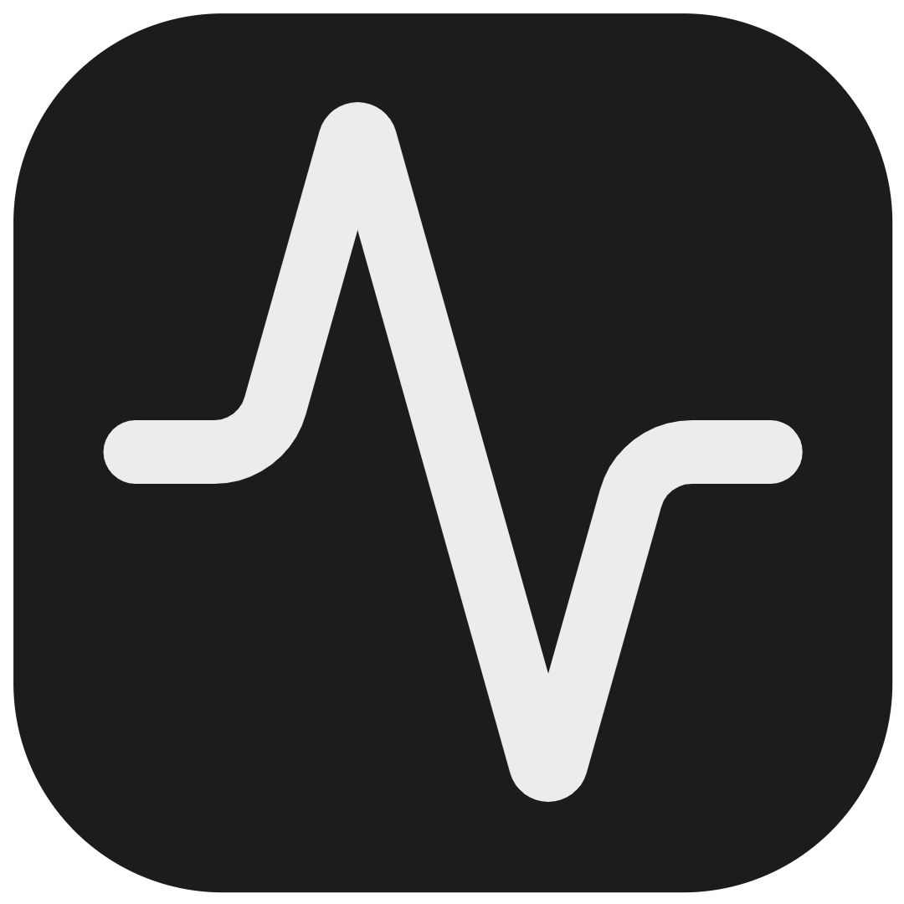
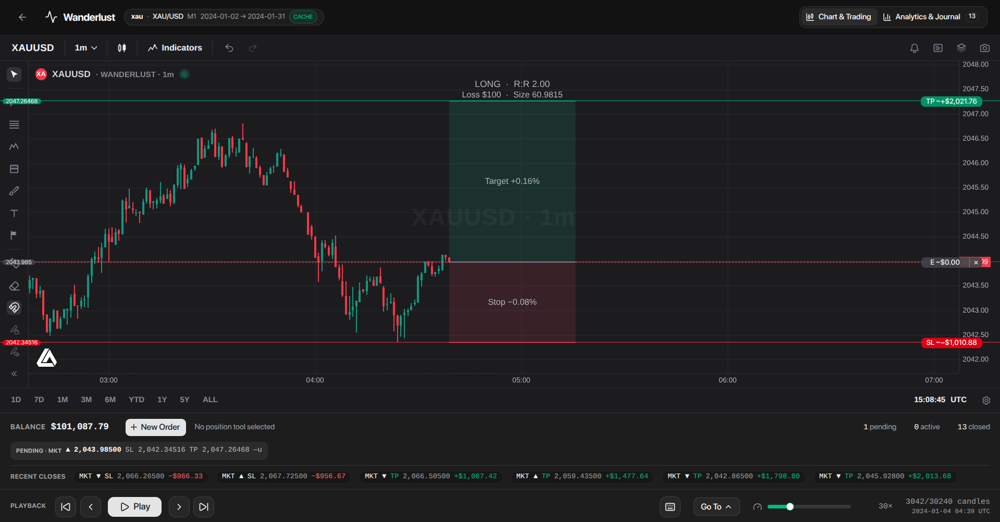

# Wanderlust

<p align="center">
  
</p>

> 

Wanderlust is an open-source, desktop trading backtester built around the **FX Replay** idea: download a market range once, replay it candle-by-candle, and trade it against a simulated account — with full analytics and a trade journal when you are done.

It runs **fully offline** after the first download. Market data is fetched on demand from Dukascopy's public datafeed, with HistData's free M1 archive as an automatic fallback, and cached locally — so there are no server costs and no subscription paywalls. Everything — data, playback, matching engine, and analysis — happens on your machine.

## Features

- **On-demand market data.** Pick an asset (currencies, metals, indices, crypto), a date range, and a starting balance. One request per trading day downloads Dukascopy's pre-computed **M1** candles; the coarser timeframes (M5 → D1) are aggregated from that same day locally. If Dukascopy is unreachable or throttled, covered FX/metals pairs automatically fall back to HistData's free M1 archive. Every timeframe for the range is downloaded in one batch and cached for reuse.
- **Candle-by-candle replay.** Play and pause, step forward/back, skip to start/end, jump to a date, and set the playback speed (1–120×). The chart only ever reveals candles that have "happened so far" — exactly like watching live markets.
- **Run-up context.** A session never starts blank: up to 24 hours of market time before the range is pre-loaded (spanning weekends and holidays), so the chart opens with a full day of price action and a sensible initial view.
- **Simulated account + risk-based sizing.** Set a risk percentage (0.25–3% templates, or custom) and your position is sized at fill from the balance (`risk / |entry − SL|`), with a live size preview before you submit.
- **Market, Limit, and Stop orders** with stop-loss and take-profit. Orders evaluate and fill tick-by-tick during playback — stop-loss checked before take-profit on every candle (conservative).
- **Trading from the chart.** Draw a **Long/Short Position** tool on the chart, click it to select, then **New Order** seeds direction, entry, SL, and TP straight from the drawing — or go fully manual.
- **Guarded rewinding.** Going backward handles positions responsibly: with a position open you get a **Close Now / Nevermind** dialog; rewinding past closed trades warns that their PnL will disappear.
- **Analytics & journal.** KPI cards, equity curve, calendar PnL, and a per-trade journal with deep insights on your closed trades.
- **Live balance.** The trading strip tracks your balance, pending/active/closed order counts, and recent closed trades with realized PnL.

## Keyboard shortcuts

| Shortcut          | Action       |
| ----------------- | ------------ |
| `Space`           | Play / Pause |
| `Ctrl` + `O`      | New Order    |
| `Ctrl` + `Space`  | Step forward |
| `Shift` + `Space` | Step back    |

Shortcuts are ignored while typing in a field or inside an open dialog. A button in the playback bar (keyboard icon) shows the current list anytime.

## How it works

### Data

`src/main/dukascopy.ts` fetches Dukascopy's pre-computed native candle files — one small request per symbol per day instead of per-candle tick streaming, which keeps the app under Dukascopy's rate limiter (short exponential-backoff retries plus adaptive pacing between days). Files are LZMA-compressed `bi5` format and decoded in the main process (`src/main/bi5.ts`; weekends are skipped since most markets publish no Saturday data).

When Dukascopy fails with a network, throttling, or decode error, `src/main/histdata.ts` downloads the symbol's free Generic ASCII **M1** archive and supplies only the missing day. Recent years come as one ZIP per month; older history only exists as a whole-year ZIP, so those days are filtered out of the yearly file (one download serves a whole year). Timestamps are New York wall-clock time **with daylight saving** — resolved through the `America/New_York` zone rather than a fixed offset, because that is what the files actually contain. Coarser timeframes are derived exactly as they are for Dukascopy. HistData does not publish every Wanderlust instrument, so the fallback map is explicit and never substitutes a similar-but-different contract. Once a failure has been covered by HistData, the primary is skipped for the next 5 minutes so a long range does not pay the retry window on every day.

A Dukascopy `404` is **not** taken as proof that a day is empty: under rate limiting the datafeed also answers `404` to days it does have (a day with 1400+ candles 404s, while a holiday serves `200`). So on a weekday a covered instrument gets a second opinion from HistData before the day is written off — if HistData has candles, the day is filled from HistData; only when both providers are empty is it a real quiet day. Instruments HistData does not publish keep the `404`-is-final behaviour, since nothing could contradict it. Any requested trading day that no provider can fill is then named in the download message and the session error, instead of the range silently coming back short.

Every fetched day is written to a local **SQLite cache** (`app.getPath('userData')/wanderlust-cache.db`), and every download is cache-first: days already stored are served from disk with zero network traffic. Each candle also records whether Dukascopy or HistData supplied it, shown in Settings → Storage. Re-running a session on a cached range is instant.

### Playback

Playback is a single index into each timeframe's candle array. The chart is driven by an in-place market update on every reveal, so switching timeframes mid-session only shows what has already happened, and going back simply rewinds the index. The playback loop advances one candle per tick with a speed-controlled delay.

### Trading

Orders live in the session store as one `orders` array (`pending → filled → closed`). A **Market** order fills at the next candle's open; **Limit/Stop** orders fill when price trades through the entry level (buy-limit below / sell-stop above, mirrored for shorts). Each filled candle is evaluated for stop-loss first, then take-profit. Rewinding uses state restore, so positions taken later in the timeline are removed — no ghost pending orders survive a rewind.

### Sessions

The main menu lists your saved backtest sessions — resume trading, jump to analytics, or delete. Each session stores its own name, asset, range, timeframe data, balance, and full trade history in the local database.

## Tech stack

- **App shell:** Electron (Node.js backend for files, SQLite, and network)
- **Frontend:** React + Vite + TypeScript (`electron-vite`)
- **State:** Zustand
- **Charting:** `@luxalgo/vela` + `@luxalgo/vela/workspace`
- **Storage:** SQLite (`better-sqlite3`)
- **Data:** custom HTTP fetchers for Dukascopy bi5 candles + HistData M1 ZIP fallback, with `lzma-native` and `fflate` decoding
- **UI:** Tailwind CSS v4 + shadcn/ui + `lucide-react`
- **Analytics charts:** Recharts

## Getting started

```bash
npm install
npm run dev
```

| Script                                            | Purpose                                                                |
| ------------------------------------------------- | ---------------------------------------------------------------------- |
| `npm run dev`                                     | Start the app in development (HMR enabled)                             |
| `npm run build`                                   | Typecheck + build main / preload / renderer into `out/`                |
| `npm run typecheck`                               | Typecheck main (`tsconfig.node.json`) + renderer (`tsconfig.web.json`) |
| `npm run lint` / `npm run format`                 | ESLint / Prettier                                                      |
| `npm run build:linux` / `build:win` / `build:mac` | Package with electron-builder                                          |

## Using Wanderlust

1. **New Session** — name the session, pick an asset and a sensible date range (e.g. a single month), set a starting balance, and start. A progress panel streams the per-day download.
2. The **chart** opens with the run-up context pre-loaded. Switch timeframes in the chart topbar free anytime — every timeframe is already available.
3. **Playback** — hit Play, or step candle-by-candle. Watch slow, ramp the speed up, skip to jump.
4. **Trade** — draw a Long/Short Position tool on the chart, click the drawing to select it, then **New Order** (or just hit `Ctrl` + `O` for manual). Pick a risk %, review the size preview, and submit.
5. **Rewind** — step back, skip to start, or Go To an earlier date; Wanderlust guards open positions and warns before erasing trade history.
6. **Analytics** — from the main menu, open a session's analytics: KPIs, equity curve, PnL calendar, and the trade journal.

## Data & storage notes

- **Rate limits.** Dukascopy can return HTTP 429 for bursts; the fetcher uses short exponential-backoff retries and paces itself. After a few consecutive failures it switches to HistData instead of waiting on an unavailable feed. Very large ranges may take a while the first time — afterward they are served from cache.
- **Fallback coverage.** HistData supplies free M1 bid data for the mapped FX and metals pairs only. Crypto and uncovered index/CFD symbols still require Dukascopy. HistData publishes no meaningful FX volume, so fallback candles carry volume `0`; price-based trading and indicators are unaffected.
- **Fallback data quality.** The HistData tape is a different feed: bid quotes sit 1-4 pips under mid, some minutes are missing, the tape prints through the daily FX close (so Friday's evening session is absent), and for roughly three weeks after each DST change HistData's own stamps are an hour off. Treat fallback ranges as good for structure and practice, not for tick-accurate fills.
- **Mixed feeds.** A range can combine Dukascopy and HistData days when only part of a download fails. Sources are labelled in the session badge and Settings → Storage, but broker feeds can differ slightly in spread and aggregation.
- **Quiet days.** Weekends and holidays return no data for most assets (crypto trades 7 days). Saturdays are skipped without a request. On a weekday a Dukascopy 404 is cross-checked against HistData before the day is called empty, because Dukascopy answers 404 to days it does have when it is throttling.
- **Recent days.** Providers publish with a lag — the in-progress day usually has no file yet, and HistData's current-month archive trails by several days. A range ending on the last day or two can therefore come back with those days missing; the download message and any session error name them so the end date can be pulled back.
- **Forward-filled candles.** Dukascopy's feed carries synthetic same-OHLCV candles in gaps; the decoder filters these so they never distort your backtest.

## Development

```
src/
├── shared/     # IPC contract, timeframes, instrument list (shared main ⇄ renderer)
├── main/       # Electron main: IPC, SQLite cache, Dukascopy + HistData fetchers, decoders
├── preload/    # contextBridge — exposes the typed window.api to the renderer
└── renderer/   # React app: sessions, chart, playback, trading, analytics
```
